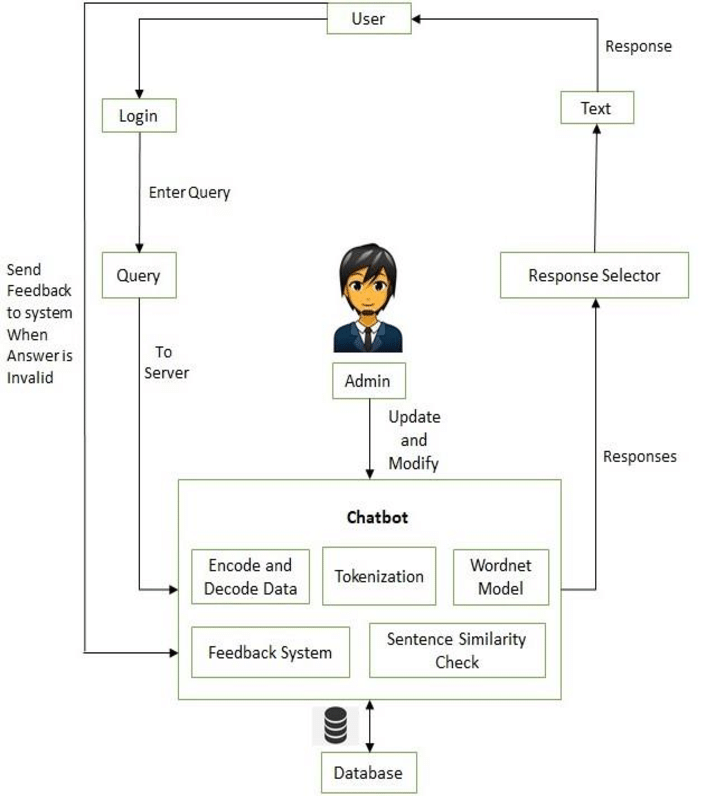

# 🎓 AI-Powered University Chatbot

An intelligent academic assistant designed to streamline communication and support within a university environment. Built with Python and integrated with Google Gemini Pro, this chatbot provides students with instant, conversational access to academic information, college services, and FAQs.



## 🚀 Overview
Developed during a final semester internship at HYPX ECOSYSTEM LLP, this project acts as a digital bridge between students and college administration. By leveraging Natural Language Processing (NLP), the bot accurately understands user intent to reduce the need for manual staff intervention and promote efficiency in academic support systems.

## 🛠️ Tech Stack
* **Frontend:** Streamlit
* **Language:** Python
* **AI Model:** Google Gemini Pro (via API)
* **Databases:** MongoDB (NoSQL), SQLite (Relational)

## 📸 Interface Sneak Peek
* [View Chatbot Home](assets/Home_of_chatbot.jpg)
* [View Admin Panel](assets/admin_panel.jpg)

## 📄 Project Documentation
* [Read the Full Project Report](docs/Gopesh_Report.pdf)
* [View the Presentation Slides](https://github.com/gopesh-007/University-Chatbot/blob/282d8f3bb2f5ff5fbacda561dd275c0024f69ab6/docs/University%20ChatBot%20PPT.pdf)

## ⚙️ How to Run Locally

**1. Clone the repository:**
```bash
git clone [https://github.com/your-username/University-Chatbot.git](https://github.com/your-username/University-Chatbot.git)
cd University-Chatbot
